## May 17 2026

Started working on the CAD model. The goal is to make all of the electronics seperate from the planter to reduce the risk of water accidently getting into the electronics. As opposed to the LEDs in v1, I'm going to try a reflective design where the lights will bounce off the walls rather than being diffused.

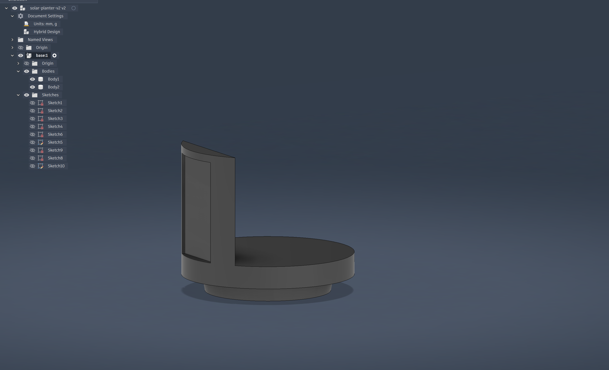

**Total time: 1.5 hrs**

## May 18 2026

Did some more work on the CAD model by adding a cutout for the wires from the solar panel and the moisture sensor. I was able to get rid of the cutout on the base and instead make the wires go through the bottom, where they will be almost invisible from most angles. I also started working on the PCB schematic, which will be based on the ESP32 C6-mini, giving me the ability to use zigbee instead of WiFi for the firmware.

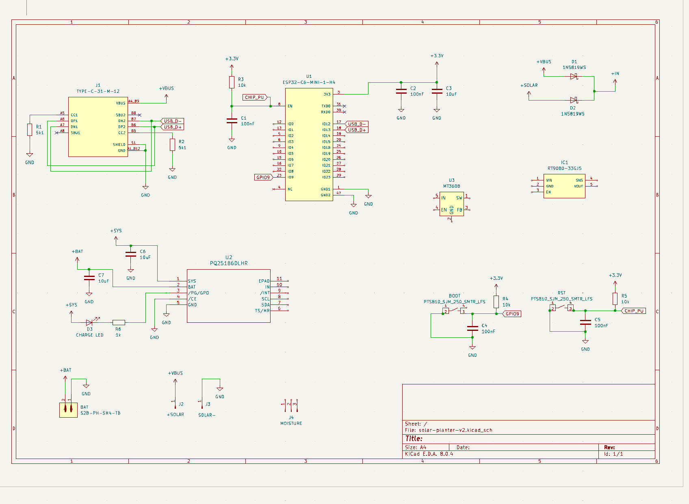
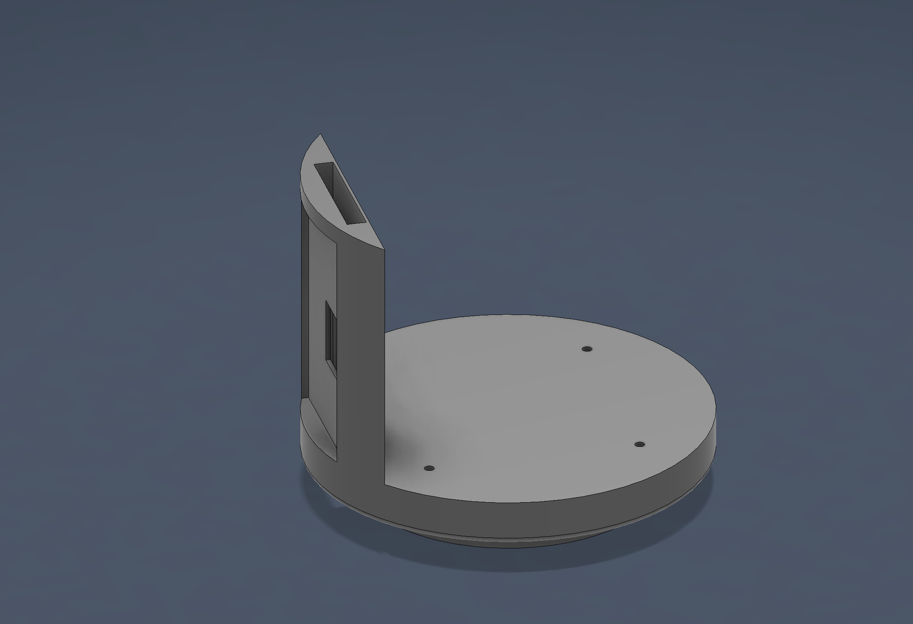

**Total time: 1.6 hrs**

## May 19 2026

Added in the rest of the components to the schematic and finished all of the remaining routes. I'm still not fully settled on the components and I might end up exposing some more of the wires in order to allow for easier future expansion. I'm also still not sure how much IO I want to have besides the switch and usb-c for programming, since everything else has to be done through the software at the moment.

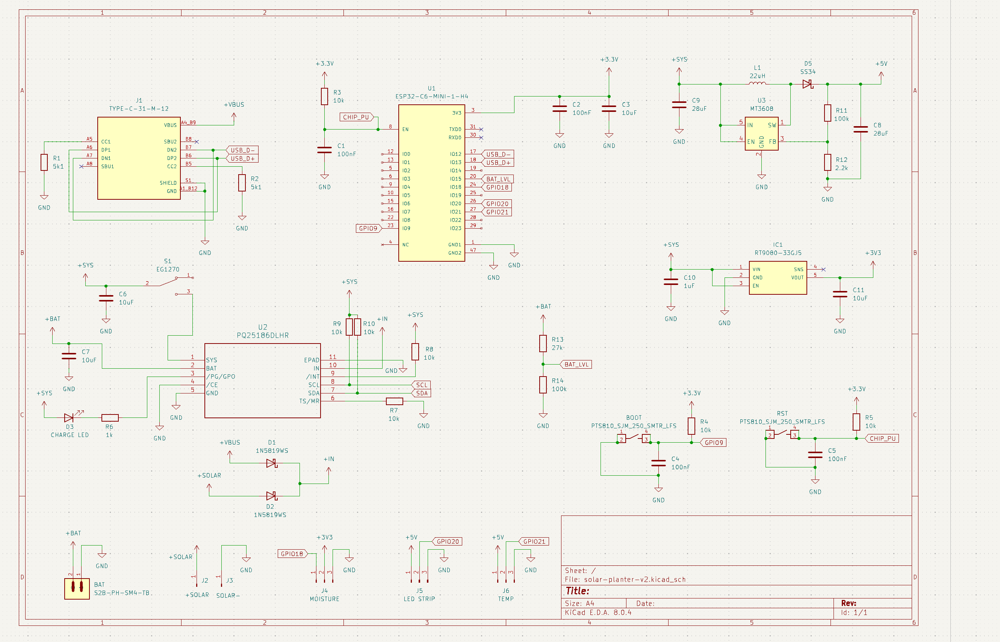

**Total time: 1.4 hrs**

## May 20 2026

Polished up the schematic and went over each part and compared it to the datasheet to make sure I didn't make any careless mistakes. I was able to catch a couple, the i2c pins werent connected, a couple of capacitors were too small, and the voltage divider on the boost circuit was incorrect. I also made some of the connections less confusing and reorganized the layout for readability. It's now time to route all of the traces on the pcb.

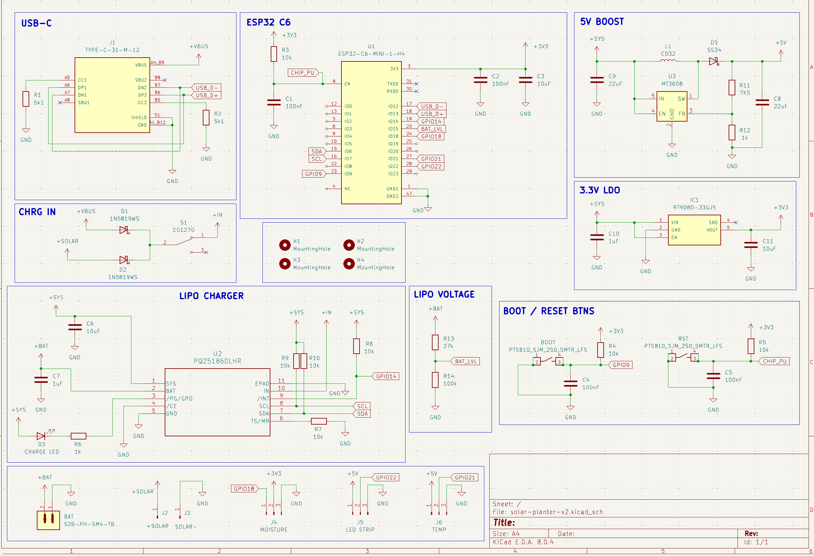

time: 1.5 hrs

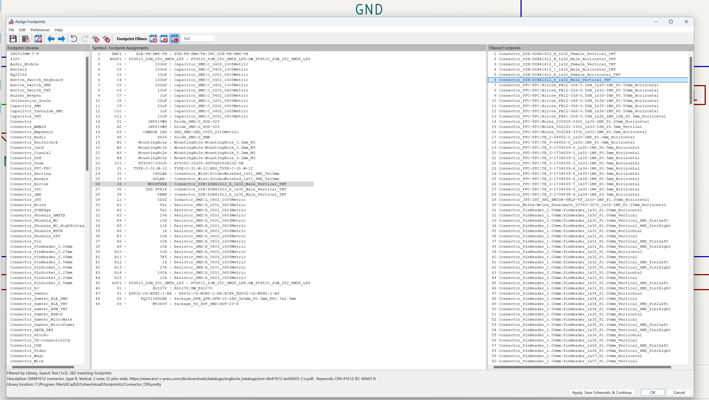
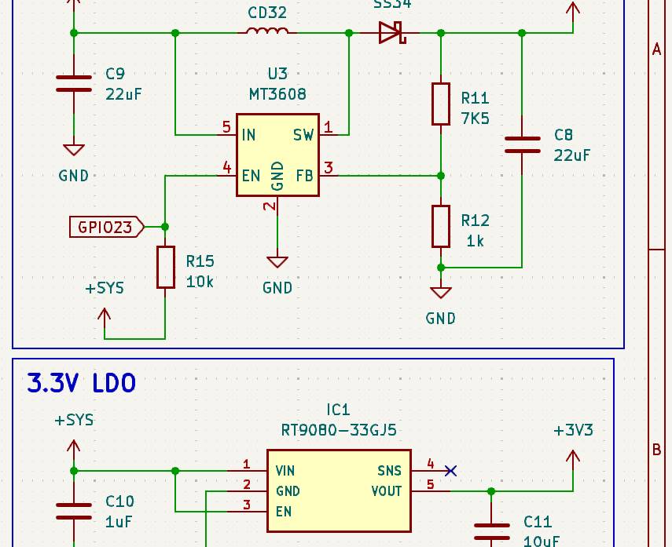

I decided to double check the current draw of MT3608 and found that it draws quite a bit of current even when it is idle. This would be the case for my board since I had EN hardwired to the SYS voltage wire. To improve efficiency, I added in a pull up resistor connected to a pin on the ESP32 so that I could programatically switch off the boost converter when I know that I will not need it, for ex in deep sleep. This should have a big impact on battery.

time: 0.5 hrs

**Total time: 2 hrs**

## May 21 2026

Started working on the PCB design and arranged all of the footprints so that hopefully it will be easier to route all of them. I realized that I completely messed up the footprints for the connectors and the resistors/capacitors since some of them were in 0201 size, which is way smaller than 0603. After fixing that I also had to enlarge the pads for the solar/led connection, but I decided to keep the sensors as pins since they already have dupont cables included.

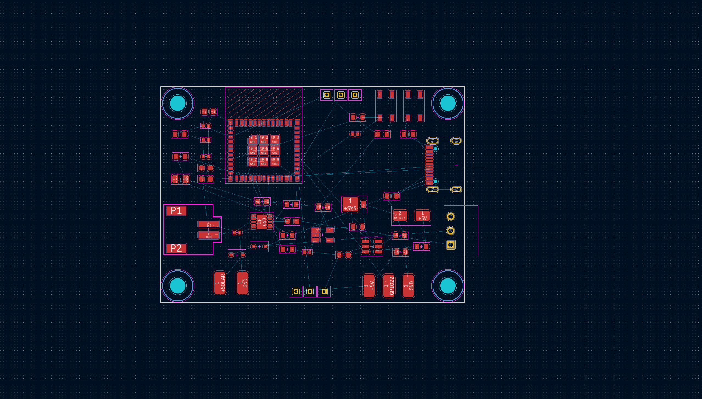

**Total time: 1.4 hrs**

## June 8 2026

Started routing the traces for the PCB. Before that, I added in an extra couple of pins to breakout the i2c line to make this board more versatile if I wanted to switch out the sensors some time in the future. I routed almost all of the pads that I could without switching to the back layer since I don't want to use too many unneccessary vias. I'm pretty happy with how they're looking right now and this definitely has to be one of my neatest looking boards so far.

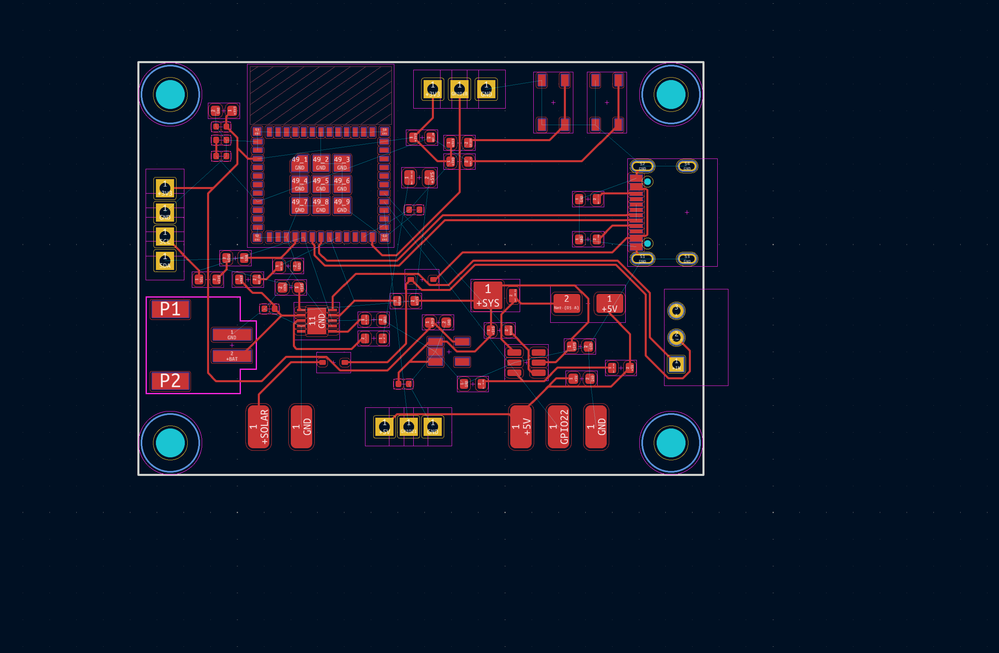

**Total time: 2 hrs**

## June 9 2026

Finished all of the routes for the PCB, fixed some of the silk screen, added in labels, and created the ground fill. Unfortunately there a couple of islands created via the ground fill, and I couldn't figure out how to easily fix without putting a via on the pad. Although this should be fine, this did make the board not as clean as I wanted it to be. On the flip side, I also added in some beautiful rounded corners which I plan on doing for every PCB I make from now on. Time to get the board checked and make any small modifications that might be needed.

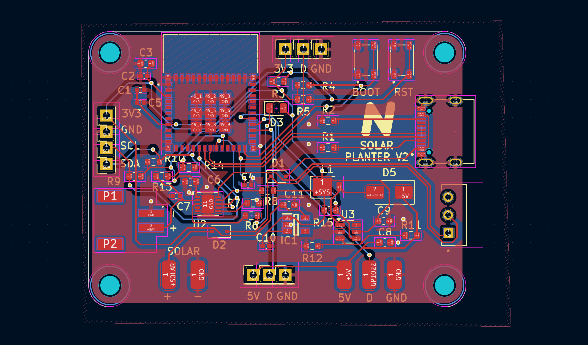

**Total time: 2.3 hrs**

After sending my PCB and schematic for some feedback, I got a suggestion to make the traces for the power lines a bit wider. So I changed all of the power carrying traces (except for the battery ones) to use 0.4mm trace widths instead of the default 0.25mm. I also added in some silk screen on the maximum input voltage for the solar panel as a safety in case I want to experiment with different panels in the future.

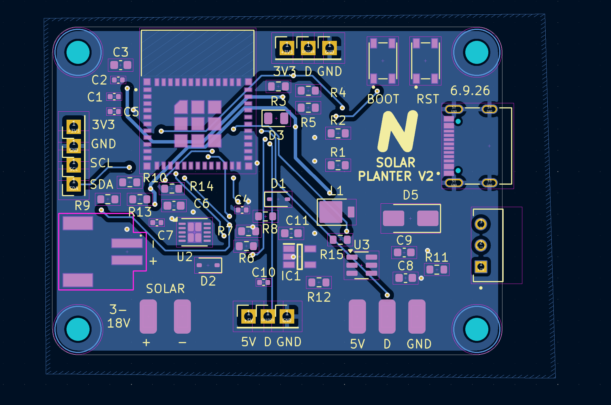
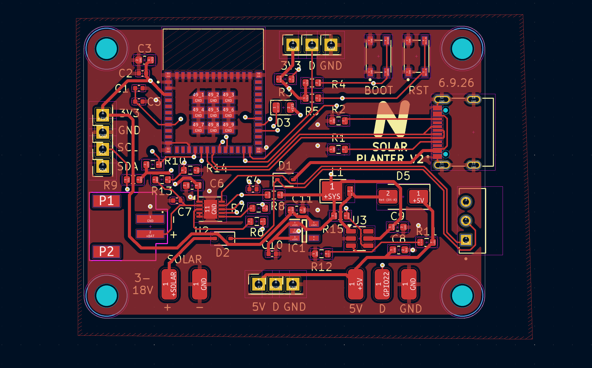

**Total time: 1 hr**

Did some more on the 3D model and added in the removable plant-pot enclosure. The plan is to have this be completely isolated from the electronics enclosure, and secure the plant-pot holder with magnets which would let you easily take it out and drain any water that gets collected in the bottom. It will also have the benefit of added customizability, since it would be easy to tweak the holder for smaller pots.

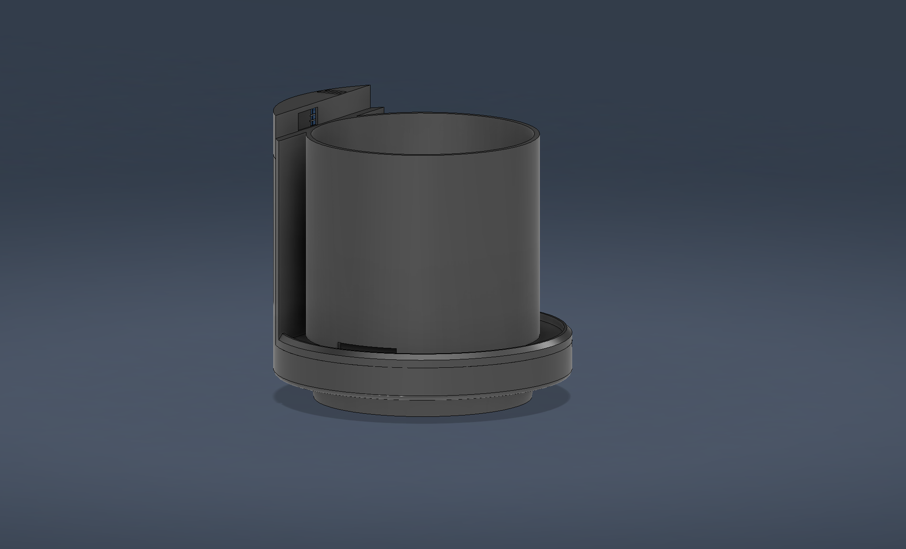

**Total time: 1.6 hr**