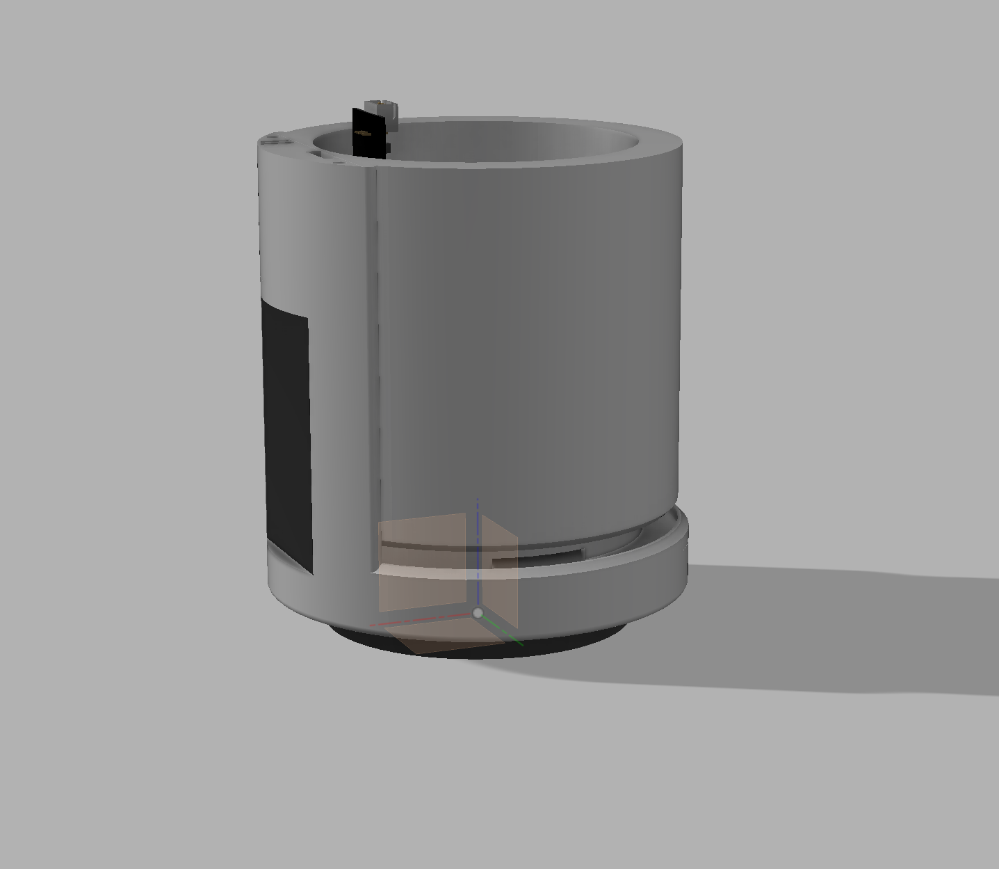
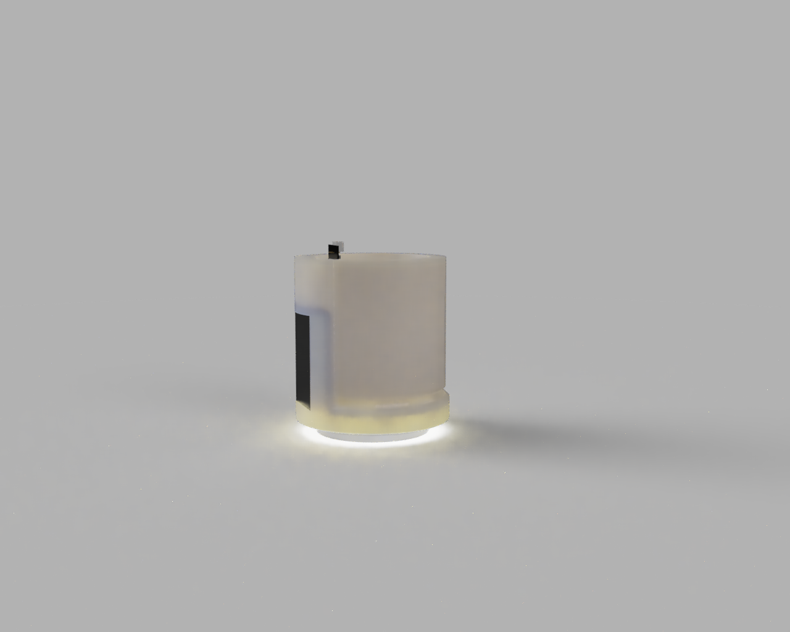
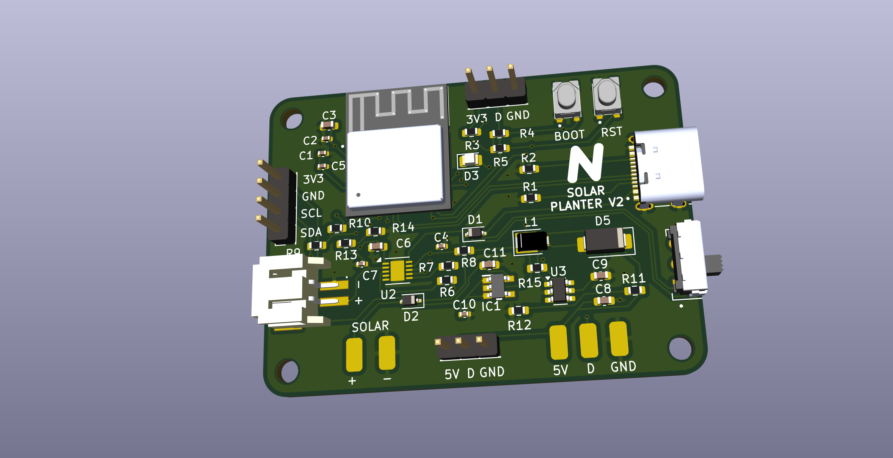

# Solar Planter V2
Integrates temperature, humidity, and soil moisture sensing into a single discrete plant pot and notifies you of the plant's health using LEDs and push notifications via IOT. The pot features a solar panel on the side to slowly recharge the internal battery, removing the need for recharging the device manually.
### Features
- Zigbee and Matter connectivity for low power wireless communication
- RGB Leds for notification
- Easily removable plant pot via magnets for a modular design
- Removable temperature and humidity sensor module

